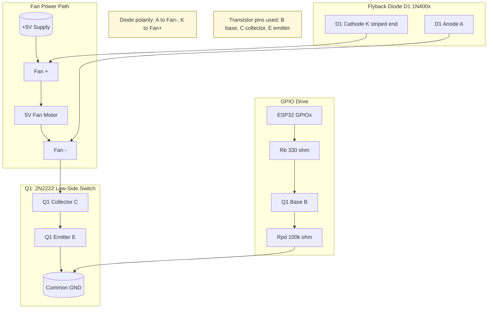

# ESP32 5V Fan Wiring (2N2222 Low-Side Switch)

This wiring lets an ESP32 GPIO pin turn a 5V, 0.2A fan on/off using a 2N2222 transistor.

## Parts

- 1 x 2N2222 (TO-92)
- 1 x base resistor: 330 ohm (recommended)
- 1 x base pulldown resistor: 100k ohm
- 1 x flyback diode: 1N4001-1N4007 (or similar)
- 1 x 5V fan (0.2A)
- 5V supply with enough current for fan startup surge

## Important Notes

- Use fan power from 5V, not 3.3V.
- ESP32 GND and fan 5V supply GND must be connected together.
- 2N2222 TO-92 pinout can vary by manufacturer. Verify your exact transistor datasheet before wiring.

## Connection Table

- ESP32 GPIOx -> 330 ohm resistor -> 2N2222 base
- 2N2222 base -> 100k ohm resistor -> GND
- 2N2222 emitter -> GND
- 2N2222 collector -> fan negative (-)
- Fan positive (+) -> +5V
- Flyback diode across fan:
  - Diode cathode (striped end) -> fan + / +5V
  - Diode anode -> fan - / transistor collector

## Wiring Diagram (ASCII)

                    +5V
                     |
                     |------------------------+
                     |                        |
                 Fan (+)                  Diode cathode
                     |                        |
                 [  FAN  ]                    |
                     |                        |
                 Fan (-)------o---------------+
                               |
                         2N2222 collector
                               |
ESP32 GPIOx ---330 ohm---+-----B
                          |    |
                       100k   2N2222
                          |    |
GND ----------------------+----E------------------- GND

Diode anode -> at the collector/fan(-) node
Diode cathode -> at +5V/fan(+) node

## Wiring Diagram (Mermaid)

## Practical Recommendation

- Start with 330 ohm base resistor.
- If your specific fan fails to start reliably, check startup current and transistor heating.
- For higher reliability at startup surge currents, use a logic-level N-MOSFET in a future hardware revision.
