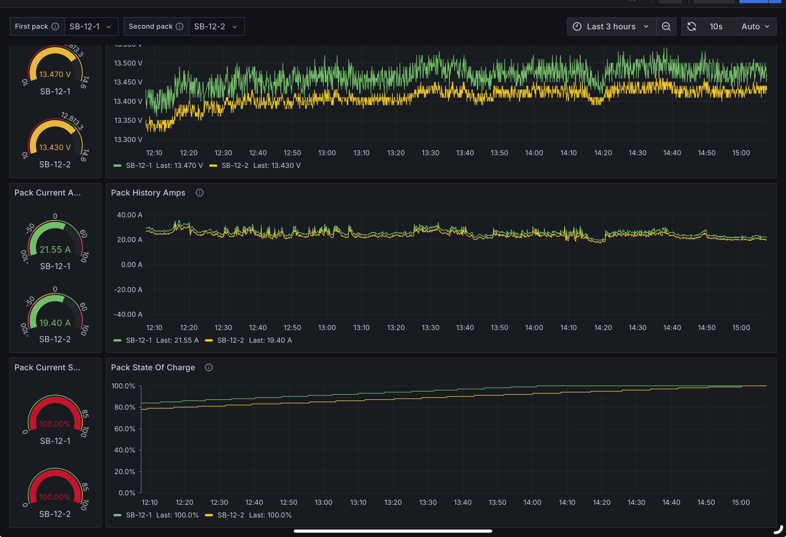

# Grafana Dashboard Files

This folder contains the optimized Grafana dashboard configuration and query files for the JKBMS2ESPMQTT project.

## Structure

### Main Files
- `Grafana DualBMS Dashboard.json` - Complete Grafana dashboard configuration
- `README.md` - This file

### Optimized_Queries/
Contains the high-performance Flux queries with intelligent bucket selection:

**Pack Voltage Queries:**
- `Query_A_Pack_Voltage.flux` - Battery Pack 01 voltage history
- `Query_B_Pack_Voltage.flux` - Battery Pack 02 voltage history

**Pack Current Queries:**
- `Query_A_Pack_Current.flux` - Battery Pack 01 current history
- `Query_B_Pack_Current.flux` - Battery Pack 02 current history

**State of Charge Queries:**
- `Query_A_Pack_SOC.flux` - Battery Pack 01 SOC history
- `Query_B_Pack_SOC.flux` - Battery Pack 02 SOC history

**Individual Cell Voltage Queries:**
- `Query_A_Individual_Cells.flux` - Battery Pack 01 individual cell voltages
- `Query_B_Individual_Cells.flux` - Battery Pack 02 individual cell voltages

### Documentation/
- `Implementation_Guide.md` - Step-by-step implementation guide
- `Performance_Optimization_Guide.md` - Performance optimization details

### Images/
- Screenshots and visual documentation

## Performance Features

All queries include:
- **Intelligent Bucket Selection**: Automatically chooses optimal data source based on time range
  - ≤ 6 hours: Raw 5-second data (BMS bucket)
  - ≤ 2 days: 30-second aggregates (BMS_30s bucket)
  - ≤ 2 weeks: 5-minute aggregates (BMS_5m bucket)
  - > 2 weeks: 1-hour aggregates (BMS_1h bucket)
- **Sub-5-second query times** across all time ranges
- **Elimination of "too many data points" errors**
- **100x performance improvement** over real-time aggregation

## Usage

1. Copy the contents of any query file from `Optimized_Queries/`
2. Paste into the corresponding Grafana panel query field
3. Enjoy lightning-fast dashboard performance!

## Requirements

- InfluxDB 2.x with parallel bucket strategy implemented
- Grafana with InfluxDB data source configured
- Aggregation tasks running for BMS_30s, BMS_5m, and BMS_1h buckets

## Dashboard Screenshot

